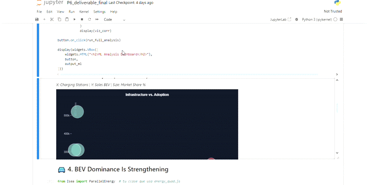

# Bubble Chart

**Purpose:** To explore relationships between three continuous variables across different entities, revealing clusters and outliers.

This visualization uses position (X and Y axes) and size (bubble radius) to encode three dimensions of data simultaneously, making it ideal for comparing countries or regions across multiple metrics.



---

### Components and Features

1.  **Interactive Bubbles:**
    -   Each bubble represents an entity (e.g., a country or region).
    -   The X position, Y position, and radius encode three different metrics.
    -   **Hover:** Displays detailed information including all three metric values and the group category.

2.  **Color-Coded Groups:**
    -   Bubbles are colored by a categorical variable (e.g., continent or vehicle type), making it easy to identify patterns within groups.

3.  **Automatic Scaling:**
    -   The chart automatically adjusts axis ranges based on the data, with square-root scaling for bubble sizes to ensure accurate area representation.

---

### How to Build

The `D3Bubble` widget accepts a list of dictionaries, where each dictionary represents one bubble. Each record must contain:

-   `id`: A unique identifier (e.g., country name)
-   `x`: Value for the X-axis
-   `y`: Value for the Y-axis
-   `r`: Value for the bubble radius (size)
-   `group`: A categorical value for color coding

Simply prepare your data as a list of records and pass it to the widget constructor along with axis labels.

#### Quick Example

```python
from Isea.bubble import D3Bubble

# Sample data: comparing countries
data = [
    {"id": "USA", "x": 1500000, "y": 250000, "r": 8.5, "group": "Americas"},
    {"id": "China", "x": 6800000, "y": 1200000, "r": 12.3, "group": "Asia"},
    {"id": "Germany", "x": 850000, "y": 180000, "r": 18.2, "group": "Europe"},
    {"id": "Norway", "x": 120000, "y": 45000, "r": 82.4, "group": "Europe"},
    {"id": "Japan", "x": 450000, "y": 95000, "r": 6.1, "group": "Asia"},
]

bubble = D3Bubble(
    data=data,
    title="EV Stock vs Sales by Country",
    xLabel="Total EV Stock",
    yLabel="Annual Sales",
    zLabel="Market Share",
    width=700,
    height=500
)

bubble
```

---

### Available Configuration Options

| Parameter | Type | Description |
|-----------|------|-------------|
| `data` | list | List of dictionaries with `id`, `x`, `y`, `r`, `group` keys |
| `title` | str | Chart title displayed at the top |
| `xLabel` | str | Label for the X-axis |
| `yLabel` | str | Label for the Y-axis |
| `zLabel` | str | Label for the size dimension (shown in tooltip) |
| `width` | int | Chart width in pixels (default: 700) |
| `height` | int | Chart height in pixels (default: 500) |

---

### Analytical Questions This View Can Answer

-   Which countries have high EV sales but low market penetration?
-   Are there regional clusters in adoption patterns?
-   Which outliers are punching above their weight in the EV transition?