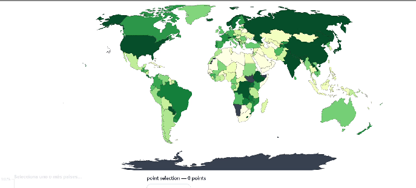

# Our Interactive Visualizations

This project features two primary, coordinated visualizations designed to provide a comprehensive overview of the global EV transition, from a high-level geographic perspective to a detailed diagnostic analysis.

---

## 1. Global Adoption & Infrastructure Map

The world map provides a geographic overview of electric vehicle adoption and charging infrastructure. It serves as the main entry point for exploring the dataset, allowing you to quickly identify regional trends and outliers.

### Key Features

- **Metric Selection:** You can switch between several key metrics to color the map, including:
    - **EV Stock Share:** The proportion of the national fleet that is electric.
    - **EV Sales Share:** The proportion of new vehicle sales that are electric.
    - **Charging Infrastructure:** The total number of public charging points.
- **Interactive Time Series:** Clicking on a country displays its **entire historical trajectory** for the selected metric in the time-series line chart below the map.

### Analytical Purpose

This view helps you answer high-level questions such as:
- Which regions are the clear early adopters (e.g., Nordics, China)?
- Which countries are showing rapid growth in recent years?
- Are there regions where charging infrastructure is lagging behind adoption rates?
- Can we spot any outliers that deviate significantly from their neighbors?

---

## 2. Transition Dynamics Scatter Plot

This interactive scatter plot is a powerful diagnostic tool for revealing the *current behavior* and dynamics of the EV transition within selected countries and vehicle modes.

### Key Features

- **Dynamic Axes:** Choose any two metrics to plot against each other for comparative analysis.
- **Time Slider:** Animate the plot over time to see how different regions and modes have evolved.
- **Brushing and Linking:** Select a group of data points by clicking and dragging. A second, linked scatter plot will appear below, showing only your selected data for focused analysis.
- **Legend Filtering:** Click on items in the legend (e.g., "Buses", "Vans") to toggle their visibility on the plot.
- **Analytical Overlays:** Buttons to add a `y=x` diagonal line, normalize axes to a 0-100 scale, and lock the zoom level for consistent year-over-year comparison.

### Analytical Purpose

This tool is designed for deep-dive analysis. For step-by-step guides on how to use it to answer specific research questions, please see our tutorials:

- **[Tutorial: Transition Analysis](../tutorials/transition.md)**
- **[Tutorial: Infrastructure Analysis](../tutorials/infrastructure.md)**

## 3. Bubble Chart

The bubble chart allows you to explore relationships between **three continuous variables** simultaneously, using position and size encoding.

### Key Features

- **Three-Dimensional Encoding:** X-axis, Y-axis, and bubble radius each represent a different metric.
- **Color-Coded Groups:** Bubbles are colored by category (e.g., continent, vehicle type) for pattern identification.
- **Interactive Tooltips:** Hover over any bubble to see detailed information for that entity.

### Analytical Purpose

This view helps you answer questions such as:
- Which countries have high EV sales but low market penetration?
- Are there regional clusters in adoption patterns?
- Which outliers are performing above or below expectations?

---

## 4. Correlation Heatmap

The heatmap visualizes relationships and correlations between multiple variables in a color-coded matrix format.

### Key Features

- **Color-Coded Matrix:** Cell color intensity represents the strength of correlation or value magnitude.
- **Flexible Colormaps:** Use sequential (`viridis`) or diverging (`coolwarm`) color schemes.
- **Interactive Tooltips:** Hover to see exact values for any cell intersection.
- **Value Labels:** Numeric values displayed directly on cells for quick reading.

### Analytical Purpose

This view helps you answer questions such as:
- Which metrics are strongly correlated with EV adoption?
- Are there unexpected negative correlations in the data?
- How do variables relate to each other across the dataset?

---

## 5. Trend Line Chart

The trend line chart combines historical data with forecasts, allowing you to track and compare multiple time series on a single view.

### Key Features

- **Dual-Line Encoding:** Solid lines for historical data, dashed lines for predictions.
- **Interactive Legend:** Click to toggle series visibility for focused comparisons.
- **Hover Crosshair:** Vertical line displays all values at the selected year.
- **Automatic Scaling:** Axes adjust dynamically based on visible series.

### Analytical Purpose

This view helps you answer questions such as:
- Which countries are leading the EV transition and by how much?
- How do growth trajectories differ between early adopters and late entrants?
- What do forecasts suggest about future market dynamics?
- When might lagging countries catch up to leaders?

---

<!-- ...existing code... -->

## Detailed Documentation

For in-depth information on each visualization, including implementation details and code examples:

-   **[World Map & Line Chart](/visualizations/world_map/):** Geographic entry point for global trends.
-   **[Diagnostic Scatter Plot](/visualizations/scatter_plot/):** Core tool for comparative analysis.
-   **[Parallel Coordinates Plot](/visualizations/parallel_plot/):** Multivariate country profile comparison.
-   **[Bubble Chart](/visualizations/bubble_chart.md/):** Three-variable relationship explorer.
-   **[Correlation Heatmap](/visualizations/heatmap_chart.md/):** Matrix view for correlations and cross-tabulations.
-   **[Trend Line Chart](/visualizations/trendline_chart.md/):** Historical trends and forecast comparisons.
-   **[Advanced Analysis Panel](/visualizations/ml_panel/):** On-demand ML toolkit for structural insights.